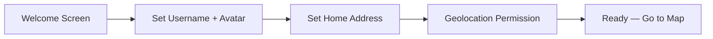
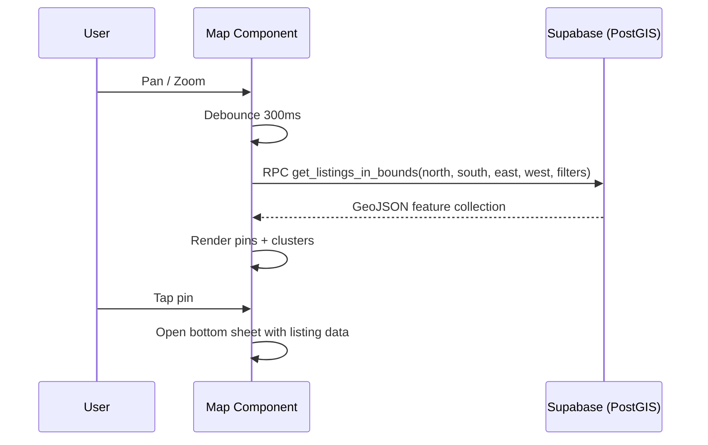
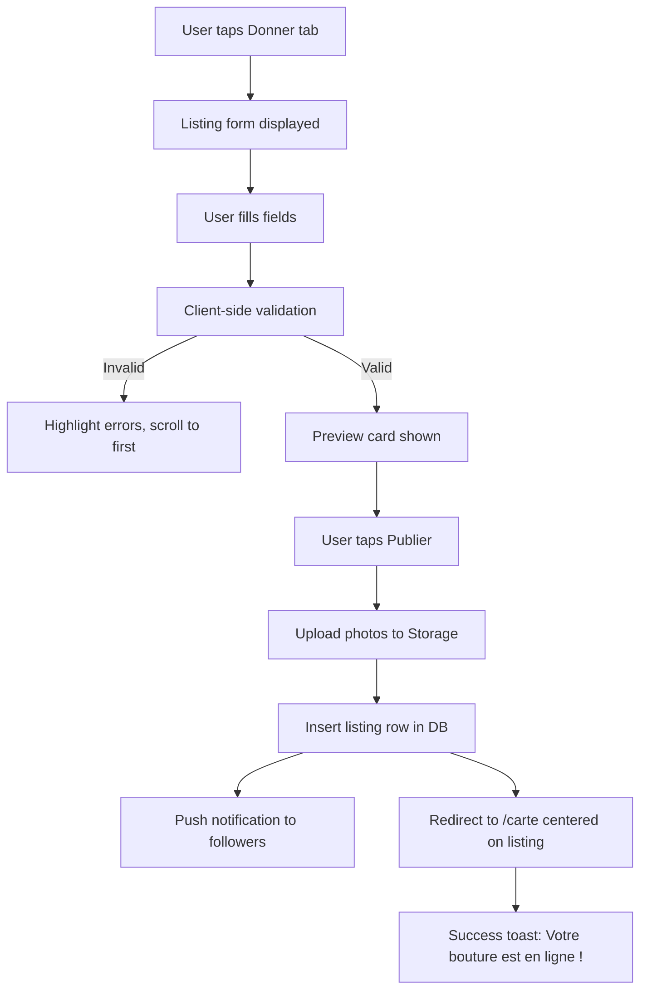
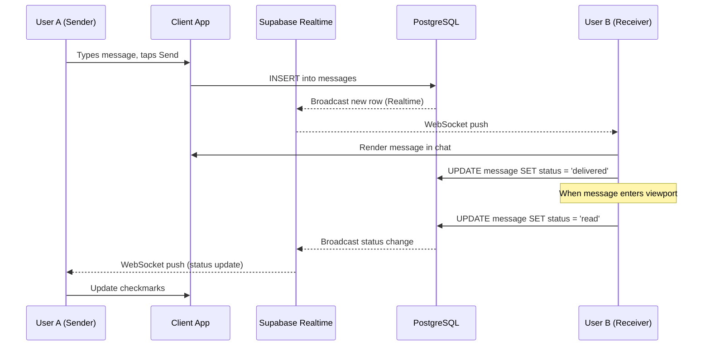
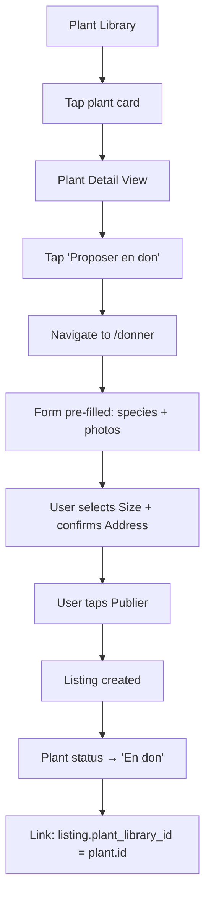
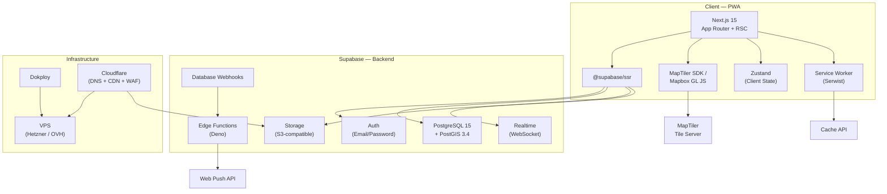
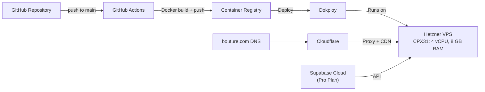

# bouture.com — Product Requirements Document

**Version:** 1.0
**Date:** March 20, 2026
**Status:** Draft
**Author:** Product & Engineering Team

---

## Table of Contents

1. [Executive Summary and Vision](#1-executive-summary-and-vision)
2. [Target Audience and User Personas](#2-target-audience-and-user-personas)
3. [Information Architecture](#3-information-architecture)
4. [Core Features and Functionality](#4-core-features-and-functionality)
   - 4.1 [Authentication and Onboarding](#41-authentication-and-onboarding)
   - 4.2 [Carte des boutures — Cuttings Map](#42-carte-des-boutures--cuttings-map)
   - 4.3 [Donner une bouture — Add a Cutting](#43-donner-une-bouture--add-a-cutting)
   - 4.4 [Mes conversations — Messaging](#44-mes-conversations--messaging)
   - 4.5 [Profil Utilisateur — User Profile](#45-profil-utilisateur--user-profile)
5. [UI/UX Design Principles and Design System](#5-uiux-design-principles-and-design-system)
6. [Technical Architecture](#6-technical-architecture)
7. [PWA Specifications and Non-Functional Requirements](#7-pwa-specifications-and-non-functional-requirements)
8. [MVP Roadmap and Phase 2 Features](#8-mvp-roadmap-and-phase-2-features)
9. [Deployment and Launch Strategy](#9-deployment-and-launch-strategy)
10. [Metrics and Success Criteria](#10-metrics-and-success-criteria)
11. [Appendices](#11-appendices)
    - A. [Database Schema (SQL)](#appendix-a-database-schema)
    - B. [Size Category Definitions](#appendix-b-size-category-definitions)
    - C. [Species Database Seed Strategy](#appendix-c-species-database-seed-strategy)
    - D. [Privacy and GDPR](#appendix-d-privacy-and-gdpr)

---

## 1. Executive Summary and Vision

### 1.1 Product Overview

**bouture.com** is a mobile-first Progressive Web App (PWA) for the free, local exchange of plant cuttings between individuals. The platform connects people who propagate plants with those seeking to grow their collection — at zero cost, powered by generosity alone.

The app centers on an immersive interactive map (inspired by [SeLoger.com](https://www.seloger.com)) where users discover available cuttings nearby, a streamlined donation form, a WhatsApp-grade real-time messaging system for coordinating exchanges, and a personal plant library that doubles as a sharing engine.

### 1.2 Vision Statement

> *Turn every windowsill into a seed bank and every gardener into a generous neighbor.*

bouture.com aspires to become the global reference platform for free plant exchange. By removing the friction of buying and selling, the platform nurtures a gift economy around plants — building local communities of growers who share abundance rather than accumulate it.

### 1.3 Key Value Propositions

| Value | Description |
|-------|-------------|
| **Zero-cost exchange** | No commerce, no payments, no fees. Pure generosity-driven community. |
| **Hyper-local discovery** | Immersive map interface shows exactly what cuttings are available nearby. |
| **Beautiful design** | Nature-focused, senior-level UI that feels like stepping into a greenhouse. |
| **Seamless coordination** | Real-time messaging with listing context makes exchanges effortless. |
| **Personal plant library** | A botanical passport that turns any collection into a potential gift catalog. |

### 1.4 Scale Target

**100,000 Monthly Active Users (MAU)** within 12 months of public launch.

### 1.5 Monetization

Out of MVP scope. The MVP is entirely free. Future considerations may include:

- Promoted listings (pay to boost visibility on the map)
- Premium plant identification via AI
- Non-intrusive partnerships with local nurseries or gardening brands
- Optional "tip jar" for donors

### 1.6 Geographic Scope

**Global from day one.** The platform will launch in French (primary language of the UI) with English as an immediate secondary target for Phase 2. The map and geolocation infrastructure supports any location worldwide.

---

## 2. Target Audience and User Personas

### 2.1 Primary Personas

#### Persona 1: Marie — The Urban Plant Mom

| Attribute | Detail |
|-----------|--------|
| Age | 25–40 |
| Location | Apartment in a mid-to-large city (Paris, Lyon, Bordeaux, etc.) |
| Plant count | 30+ houseplants, propagates regularly |
| Pain point | Runs out of space; cuttings pile up with no one to give them to |
| Motivation | Find good homes for her propagations nearby |
| Tech profile | Smartphone-first, uses apps daily, values beautiful design |
| Key behavior | Creates 2–5 listings per month, checks messages daily |

**User story:** *"As Marie, I want to list my Monstera cuttings on a map so that someone in my neighborhood can pick them up this weekend."*

#### Persona 2: Lucas — The Beginner Gardener

| Attribute | Detail |
|-----------|--------|
| Age | 20–35 |
| Location | Recently moved into a new flat, urban area |
| Plant count | 0–5, wants more |
| Pain point | Buying plants is expensive; doesn't know where to start |
| Motivation | Discover free cuttings within walking distance |
| Tech profile | Smartphone-native, browses Instagram for plant inspiration |
| Key behavior | Opens the map 3–4 times per week, contacts 1–2 donors per week |

**User story:** *"As Lucas, I want to browse a map of free cuttings near me so that I can fill my apartment with plants without spending money."*

### 2.2 Secondary Persona

#### Persona 3: Sylvie — The Community Garden Organizer

| Attribute | Detail |
|-----------|--------|
| Age | 45–65 |
| Location | Suburban or semi-rural, active in local gardening associations |
| Pain point | Organizing exchanges is logistically hard; she uses Facebook groups and spreadsheets |
| Motivation | Coordinate bulk exchanges, build a local gardening community |
| Tech profile | Uses WhatsApp and Facebook daily; willing to try new apps if they save time |
| Key behavior | Follows many users, maintains a large plant library, creates seasonal listings |

**User story:** *"As Sylvie, I want to follow local plant enthusiasts and get notified when they offer new cuttings so that I can coordinate exchanges for my gardening club."*

### 2.3 Anti-Personas (Explicitly Out of Scope)

- **Commercial sellers:** The platform is not a marketplace. Users who attempt to sell plants should be reported.
- **Casual browsers with no intent to exchange:** The app requires account creation to contact donors, filtering low-intent traffic.

---

## 3. Information Architecture

### 3.1 IA Hierarchy

The information architecture is derived from the provided architecture diagram and formalized below. The app is structured around four primary navigation destinations accessible via a persistent bottom navigation bar.

```mermaid
graph TD
    Root["bouture.com"]
    Root --> Map["Carte des boutures"]
    Root --> Add["Donner une bouture"]
    Root --> Chat["Mes conversations"]
    Root --> Profile["Profil"]

    Map --> SearchBar["Search / Filter Bar"]
    Map --> MapView["Interactive Map Canvas"]
    Map --> PingDetail["Ping Detail / Bottom Sheet"]
    PingDetail --> Carousel["Photo Carousel"]
    PingDetail --> ListingDetail["Full Listing Detail"]
    PingDetail --> ContactBtn["Contact Donor CTA"]

    Add --> SpeciesInput["Espece — Species"]
    Add --> SizeSelect["Taille — Size"]
    Add --> PhotoUpload["Photos Upload"]
    Add --> DescField["Description"]
    Add --> AddrOverride["Address Override"]
    Add --> Preview["Preview and Confirm"]

    Chat --> ConvoList["Conversations List"]
    Chat --> ChatView["Chat Interface"]
    ChatView --> ContextLink["Cutting Context Card"]
    ChatView --> MsgInput["Message Input Bar"]

    Profile --> Bio["User Bio / Info"]
    Profile --> Addr["Adresse — Address"]
    Profile --> Library["Bibliotheque de plantes"]
    Profile --> Subs["Abonnes — Followers"]

    Library --> LibGallery["Plant Gallery Grid"]
    Library --> PlantDetail["Plant Detail View"]
    Library --> MarkDonation["Proposer en don"]
```



### 3.2 Bottom Navigation Bar

The primary navigation is a bottom tab bar, persistent across all views except fullscreen modals (e.g., photo viewer, chat input focus on mobile).

| Tab | Icon | Label | Default? | Badge |
|-----|------|-------|----------|-------|
| Map | Map pin / leaf | Carte | Yes (home) | — |
| Add | Plus circle | Donner | — | — |
| Messages | Chat bubble | Messages | — | Unread count |
| Profile | User silhouette | Profil | — | — |

### 3.3 Navigation Flows

- **Map → Ping → Bottom Sheet → Full Listing → Contact → Chat**: The primary discovery-to-exchange flow.
- **Profile → Plant Library → "Proposer en don" → Add Cutting (pre-filled)**: The library-to-listing shortcut.
- **Chat → Context Card → Full Listing → Map (centered on listing)**: The conversation-to-listing back-reference.

### 3.4 URL Structure (Next.js App Router)

```
/                          → Redirect to /carte
/carte                     → Cuttings Map (home)
/carte/[listingId]         → Full listing detail (deep link / SEO)
/donner                    → Add a Cutting form
/messages                  → Conversations list
/messages/[conversationId] → Chat interface
/profil                    → Current user's profile
/profil/adresse            → Address management
/profil/bibliotheque       → Plant library
/profil/bibliotheque/[id]  → Plant detail
/profil/abonnes            → Followers list
/profil/abonnements        → Following list
/u/[username]              → Public profile (viewable by others)
/auth/login                → Sign in
/auth/signup               → Sign up
/auth/reset                → Password reset
/auth/onboarding           → Post-signup onboarding wizard
```

---

## 4. Core Features and Functionality

### 4.1 Authentication and Onboarding

#### 4.1.1 Overview

Users must create an account to browse listings on the map (read-only map view is accessible without auth for SEO/discoverability), but account creation is required to contact donors, create listings, or access the messaging system.

#### 4.1.2 Authentication Method

**Email + password** via Supabase Auth.

| Flow | Details |
|------|---------|
| **Sign up** | Email, password (min 8 chars, 1 uppercase, 1 number), username (unique, 3–20 chars, alphanumeric + underscores). |
| **Email verification** | Required. A verification email is sent on sign-up. Users can browse but cannot create listings or send messages until verified. |
| **Sign in** | Email + password. "Remember me" checkbox for extended session. |
| **Password reset** | Standard email-based flow: enter email → receive link → set new password. |
| **Session persistence** | JWT access token (1h expiry) + refresh token (30d). Seamless re-authentication on PWA reopen via Supabase's `onAuthStateChange` listener. |

#### 4.1.3 Onboarding Flow (Post Sign-Up)

A guided 3-step wizard shown only on first login after email verification.



**Step 1 — Welcome Screen**
- Fullscreen with botanical illustration
- Value proposition: "Decouvrez et partagez des boutures pres de chez vous"
- Single CTA: "Commencer"

**Step 2 — Set Username + Avatar**
- Username input with real-time uniqueness check (debounced 500ms query to `profiles` table)
- Avatar upload (optional): tap a circular placeholder to open camera/gallery. Client-side crop to square, resize to 400x400, compress to < 100KB WebP.
- "Suivant" button (disabled until username is valid)

**Step 3 — Set Home Address + Geolocation**
- Interactive mini-map with a draggable pin (centered on geolocated position if permission granted)
- Address text input with geocoding autocomplete (MapTiler Geocoding API)
- Explanation: "Votre adresse reste privee. Seule une position approximative sera visible sur la carte."
- "Terminer" button saves profile and redirects to `/carte`

**Acceptance Criteria:**
- [ ] User can sign up with email + password
- [ ] Verification email is sent and blocks listing/messaging until confirmed
- [ ] Onboarding wizard completes in under 60 seconds
- [ ] Username uniqueness is validated in real time
- [ ] Avatar is compressed client-side before upload
- [ ] Address is geocoded and stored as lat/lng + text components
- [ ] Geolocation permission is requested with clear explanation
- [ ] User lands on the map after completing onboarding

---

### 4.2 Carte des boutures — Cuttings Map

#### 4.2.1 Overview

The flagship feature of bouture.com. A fullscreen, immersive interactive map displaying plant cuttings available for free donation in the user's vicinity. The visual layout, interaction patterns, and information density are modeled after the SeLoger.com real estate map interface (see reference screenshot).

#### 4.2.2 Layout Specification

The map view occupies the full viewport height minus the bottom navigation bar. All controls float over the map canvas.

```
┌──────────────────────────────┐
│  [📍 75020 (Paris)  ] [Filtres] │  ← Search/Location Bar
│                                │
│         MAP CANVAS             │
│     (pins, clusters, user      │
│      location dot)             │
│                                │
│   ┌─ Results count pill ──┐   │
│   │ 42 boutures ici       │   │
│   └───────────────────────┘   │
│ ┌────────────────────────────┐│
│ │  ▉▉▉▉  Photo Carousel     ││  ← Bottom Sheet (on pin tap)
│ │  Species · Size · Donor    ││
│ │  [Contacter le donneur]    ││
│ └────────────────────────────┘│
│ ┌──┐  ┌──┐  ┌──┐  ┌──┐      │
│ │🗺│  │＋│  │💬│  │👤│      │  ← Bottom Nav Bar
│ └──┘  └──┘  └──┘  └──┘      │
└──────────────────────────────┘
```

#### 4.2.3 Search / Location Bar

Positioned at the top of the screen, floating over the map with a frosted glass or semi-transparent white background.

| Element | Specification |
|---------|---------------|
| **Location input** | Pill-shaped, left-aligned. Displays current detected location (e.g., "75020 (Paris)") or searched area. Tapping opens a full-screen search overlay with geocoding autocomplete. |
| **GPS button** | Small icon button inside or adjacent to the pill. Taps re-center the map on the user's current geolocation. |
| **"Filtres" button** | Pill-shaped, right of location input. Icon + text. Opens filter bottom sheet. Badge indicator when filters are active. |

**Geocoding Search Overlay:**
- Full-screen overlay with autofocus text input
- Results from MapTiler/Mapbox Geocoding API as user types (debounced 300ms)
- Recent searches saved locally (localStorage)
- Selecting a result centers the map on those coordinates and closes the overlay

#### 4.2.4 Filter Bottom Sheet

Opens as a draggable bottom sheet (half-screen by default, swipe up to full screen).

| Filter | Input Type | Values |
|--------|-----------|--------|
| **Espece (Species)** | Multi-select autocomplete chips | Search from species database |
| **Taille (Size)** | Multi-select chip group | Graine, Tubercule, XS, S, M, L, XL, XXL |
| **Distance** | Slider with label | 1 km – 50 km (default: 10 km) |

**Actions:**
- "Appliquer" (Apply): Closes sheet, re-fetches listings with filters
- "Reinitialiser" (Reset): Clears all filters
- Active filter count badge on the "Filtres" button in the search bar

**Acceptance Criteria:**
- [ ] Filters persist across map interactions until explicitly reset
- [ ] Species autocomplete searches the species database with debounced input
- [ ] Distance slider updates the query radius (used with `ST_DWithin`)
- [ ] Active filters are visually indicated on the Filtres button

#### 4.2.5 Map Canvas

| Property | Specification |
|----------|---------------|
| **Provider** | MapTiler SDK or Mapbox GL JS (via `react-map-gl`) |
| **Style** | Custom nature-themed style: soft greens, muted tones, reduced label density. Warm cream land color, light sage for parks, muted blue for water. |
| **Default center** | User's geolocated position (if permission granted) or a fallback default (Paris: 48.8566, 2.3522) |
| **Default zoom** | 13 (neighborhood level, ~2–3 km visible) |
| **Controls** | Zoom +/- buttons (bottom-right), geolocation re-center button, compass (on tilt) |
| **Gestures** | Pinch-to-zoom, drag to pan, two-finger tilt (mobile). Scroll zoom on desktop. |
| **User location** | Pulsing blue dot with accuracy radius circle |

#### 4.2.6 Cutting Pins (Map Markers)

Each active listing is represented as a pin on the map.

| Property | Specification |
|----------|---------------|
| **Icon** | Custom SVG: a small stylized leaf or sprout, 32x32px, using the primary green color |
| **Position** | Donor's address coordinates **jittered** by a random offset of ~200m (privacy). The jitter is computed once at listing creation and stored. |
| **Clustering** | At zoom levels < 14, pins within close proximity cluster into a circle showing the count (e.g., "12"). Cluster circles use a gradient from green (few) to terracotta (many). |
| **Interaction** | Tap a pin → slide up the bottom sheet with listing detail. Tap a cluster → zoom in to expand. |
| **Loading** | Pins animate in with a subtle bounce (200ms spring) when data loads. |
| **Viewport query** | On map `moveend` event (debounced 300ms), fetch listings within the visible viewport bounding box via PostGIS `ST_Intersects` with the viewport polygon. |

**Data Fetching Strategy:**



#### 4.2.7 Bottom Sheet — Listing Detail

When a user taps a pin, a bottom sheet slides up from the bottom of the screen, overlaying the lower portion of the map.

**States:**
1. **Peek** (default on pin tap): Shows photo carousel + key details. Height: ~40% of viewport.
2. **Expanded** (swipe up): Full listing detail. Height: ~85% of viewport.
3. **Dismissed** (swipe down): Sheet hides, map returns to full view.

**Peek State Content:**

| Element | Specification |
|---------|---------------|
| **Drag handle** | Centered pill-shaped handle at top of sheet |
| **Photo carousel** | Edge-to-edge, rounded top corners (16px). Swipeable. Pagination indicator dots or "1/5" counter (bottom-right of image, like SeLoger). Aspect ratio: 4:3. Lazy-loaded WebP images. |
| **Species name** | Bold, large text below carousel |
| **Size badge** | Colored chip next to species (e.g., green pill "M") |
| **Description snippet** | Truncated to 2 lines with "Voir plus" link |
| **Donor info** | Avatar (32px circle) + username + join date, inline |
| **"Contacter le donneur" button** | Full-width, primary CTA (terracotta accent), rounded. Fixed at bottom of sheet. |

**Expanded State Content (additional):**

- Full description text
- All photos in a vertical scrollable gallery
- Donor's approximate location label (city/arrondissement, not exact address)
- Listing age ("Il y a 3 jours")
- "Signaler" (Report) text link
- If viewing own listing: "Modifier" (Edit) and "Supprimer" (Delete) actions

**"Contacter le donneur" CTA Behavior:**

1. Check if a conversation already exists between the current user and the donor for this listing.
2. If yes: navigate to the existing conversation (`/messages/[conversationId]`).
3. If no: create a new conversation record, insert an auto-generated first message: *"Bonjour ! Je suis interesse(e) par votre bouture de **[Species]** ([Size])."*, then navigate to the new conversation.
4. If user is not authenticated: redirect to `/auth/login` with a `returnTo` parameter.

**Acceptance Criteria:**
- [ ] Map loads within 2 seconds with cached tiles
- [ ] Pins appear for all active listings within the viewport
- [ ] Clustering activates at zoom < 14 and shows accurate counts
- [ ] Pin positions are jittered for donor privacy
- [ ] Bottom sheet slides up smoothly on pin tap (< 200ms animation)
- [ ] Photo carousel is swipeable with pagination indicator
- [ ] "Contacter le donneur" creates or opens the correct conversation
- [ ] Unauthenticated users are redirected to login on CTA tap
- [ ] Viewport-based fetching debounces and does not cause excessive API calls
- [ ] Filter application updates pins within 500ms
- [ ] Search relocates the map and fetches new listings

---

### 4.3 Donner une bouture — Add a Cutting

#### 4.3.1 Overview

A clean, single-page form for creating a new cutting donation listing. Designed for speed: a returning user should be able to create a listing in under 90 seconds.

#### 4.3.2 Form Fields

| Field | Type | Required | Specification |
|-------|------|----------|---------------|
| **Espece (Species)** | Autocomplete text input | Yes | Searches the local species database (seeded from botanical API). Shows suggestions as chips below input. If no match, allows free-text entry with a "Ajouter comme nouvelle espece" option. |
| **Taille (Size)** | Chip selector (single select) | Yes | Options: `Graine`, `Tubercule`, `XS`, `S`, `M`, `L`, `XL`, `XXL`. See [Appendix B](#appendix-b-size-category-definitions) for definitions. Only one can be selected. Visual: horizontally scrollable row of pill-shaped chips. |
| **Photos** | Multi-image upload | Yes (min 1) | Minimum 1, maximum 5 photos. Tap to open native camera or gallery picker. Drag to reorder. First photo = cover image. Client-side processing: resize to max 1200px wide, convert to WebP, compress to < 300KB. Upload to Supabase Storage in a `listings/[listingId]/` path. Show upload progress per image. |
| **Description** | Textarea | No | Max 500 characters. Character counter. Placeholder: *"Decrivez votre bouture, son etat, vos disponibilites pour le retrait..."* |
| **Localisation** | Address input + mini-map | Yes (default from profile) | Pre-filled with the user's profile address. Shown on a small static map (200px tall). Toggle: "Utiliser une autre adresse" reveals a geocoding address input. Selected address updates the mini-map pin. |

#### 4.3.3 Form Flow



#### 4.3.4 Preview and Confirm

Before publishing, the user sees a preview card that replicates exactly how the listing will appear in the map bottom sheet. This builds confidence and reduces errors.

- Preview includes: cover photo, species, size badge, description snippet, donor info (current user)
- Two actions: "Modifier" (back to form) and "Publier" (submit)

#### 4.3.5 Post-Submit Behavior

1. Photos are uploaded to Supabase Storage (parallel uploads with progress bar)
2. A new row is inserted into the `listings` table with `is_active = true`
3. The listing's `location` is set from the selected address (with jitter applied)
4. A Supabase Edge Function triggers push notifications to all followers: *"[Username] vient de proposer une nouvelle bouture !"*
5. User is redirected to `/carte` with the map centered on their new listing, bottom sheet open

#### 4.3.6 From Plant Library Shortcut

When creating a listing from the Plant Library ("Proposer en don" action on a plant card):

1. Species is pre-filled from the plant's species field
2. Photos are pre-populated from the plant's gallery (user can remove/add)
3. The plant library entry status changes to `for_donation`
4. User only needs to select size, optionally write a description, and confirm address

**Acceptance Criteria:**
- [ ] Species autocomplete returns results within 200ms of typing
- [ ] Free-text species entry is allowed when no match exists
- [ ] Size selector enforces single selection
- [ ] Photo upload validates file type (JPEG, PNG, WebP, HEIC) and max 10MB raw size
- [ ] Client-side compression produces images < 300KB in WebP format
- [ ] At least 1 photo is required; form cannot submit without it
- [ ] Preview card accurately reflects the final listing appearance
- [ ] Listing appears on the map within 5 seconds of submission
- [ ] Followers receive push notifications
- [ ] Plant Library shortcut pre-fills species and photos correctly

---

### 4.4 Mes conversations — Messaging

#### 4.4.1 Overview

A fully-featured, robust instant messaging system designed to be as polished and responsive as WhatsApp. Messaging is the bridge between discovering a cutting on the map and coordinating its physical exchange.

#### 4.4.2 Conversations List (`/messages`)

A reverse-chronological list of all active conversations.

| Element | Specification |
|---------|---------------|
| **Row layout** | Left: avatar (48px circle). Center: username (bold) + last message snippet (gray, truncated 1 line) + cutting context mini-label (species name, subtle). Right: timestamp + unread badge (count). |
| **Ordering** | Most recently active conversation first. |
| **Unread indicator** | Blue dot or numeric badge on rows with unread messages. Total unread count on the Messages tab in the bottom nav. |
| **Swipe actions** | Swipe left to reveal "Archiver" (archive) and "Supprimer" (delete) actions. |
| **Empty state** | Botanical illustration + text: *"Pas encore de conversations. Parcourez la carte pour decouvrir des boutures !"* + CTA button to `/carte`. |
| **Pull to refresh** | Standard pull-down-to-refresh gesture reloads the list. |

#### 4.4.3 Chat Interface (`/messages/[conversationId]`)

**Header:**
- Back arrow (returns to conversations list)
- Other user's avatar + username (tappable → navigates to their public profile)
- Online status indicator: green dot if active (last seen < 5 min)

**Context Card (pinned):**
- A compact, tappable card below the header showing the cutting that initiated the conversation
- Content: thumbnail photo (40px square), species name, size badge
- Tap → navigates to the full listing detail view
- Visually distinct (subtle background color, thin border)

**Message Area:**
- Scrollable list of messages, newest at bottom
- Messages grouped by date with date separator labels ("Aujourd'hui", "Hier", "12 mars 2026")
- Sent messages: right-aligned, primary green bubble
- Received messages: left-aligned, light gray bubble
- Photo messages: rendered inline as a tappable thumbnail (max width 240px, rounded corners). Tap → fullscreen photo viewer.

**Message Status Indicators:**
| Status | Visual | Trigger |
|--------|--------|---------|
| Sending | Spinner icon | Message submitted, not yet confirmed by server |
| Sent | Single gray checkmark | Server confirms insert (Realtime acknowledgement) |
| Delivered | Double gray checkmarks | Recipient's client receives the message via Realtime subscription |
| Read | Double blue checkmarks | Recipient's client reports the message as read (viewport-based detection) |

**Typing Indicator:**
- When the other user is typing, show an animated "..." bubble in the received messages area
- Implementation: each user broadcasts typing state to a Supabase Realtime channel `typing:[conversationId]` with a 3-second debounce and auto-timeout

**Input Bar (bottom):**
- Text input field (auto-expanding, max 4 lines visible)
- Attachment button (📎): opens photo picker (camera or gallery). Same compression pipeline as listing photos.
- Send button: enabled only when input is non-empty or a photo is selected. Sends on tap or Enter key.

#### 4.4.4 Real-Time Architecture



**Realtime subscriptions per conversation:**
1. `messages` table changes filtered by `conversation_id` — for new messages and status updates
2. Presence channel `typing:[conversationId]` — for typing indicators
3. Presence channel `online` — for global online status tracking

#### 4.4.5 Push Notifications

When the app is backgrounded or closed, new messages trigger push notifications via the Web Push API.

| Trigger | Notification Content |
|---------|---------------------|
| New text message | **[Username]**: "[message snippet]" |
| New photo message | **[Username]** vous a envoye une photo |

Implementation: A Supabase Database Webhook on `messages` INSERT triggers an Edge Function that resolves the recipient's push subscription(s) from `push_subscriptions` and sends the notification via the `web-push` library.

**Acceptance Criteria:**
- [ ] Conversations list loads within 1 second
- [ ] New messages appear in real-time (< 500ms latency) without page refresh
- [ ] Typing indicators appear within 1 second of the other user starting to type
- [ ] Message status transitions correctly from sent → delivered → read
- [ ] Photo messages are compressed and uploaded with progress indication
- [ ] Context card correctly links to the originating listing
- [ ] Push notifications are delivered when the app is backgrounded
- [ ] Conversation list updates in real-time when a new message arrives
- [ ] Unread badge count is accurate across the app
- [ ] Messages are persisted and load correctly on page refresh (scrolled to latest)

---

### 4.5 Profil Utilisateur — User Profile

The profile section contains four sub-sections, each accessible from the profile root view.

#### 4.5.1 User Bio / Info (`/profil`)

The profile root is the user's personal dashboard.

**Layout:**
- **Header section:** Large avatar (96px), username, bio text, join date ("Membre depuis mars 2026")
- **Stats row:** Three numeric cards in a row:
  - "Boutures donnees" (cuttings donated count)
  - "Boutures recues" (cuttings received count — tracked via messaging/confirmation)
  - "Abonnes" (follower count, tappable → followers list)
- **Navigation list:** Four tappable rows leading to sub-sections:
  - Adresse → `/profil/adresse`
  - Bibliotheque de plantes → `/profil/bibliotheque`
  - Abonnes → `/profil/abonnes`
  - Parametres (Settings) → `/profil/parametres`
- **Edit profile:** "Modifier" button in the header opens an edit sheet for avatar, username, and bio

**Public Profile (`/u/[username]`):**

Other users can view a read-only version of a profile. It shows:
- Avatar, username, bio, join date, stats
- Plant library (public entries only)
- Active listings (link to map filtered by this donor)
- "Suivre" (Follow) / "Ne plus suivre" (Unfollow) button
- "Signaler" (Report) option in overflow menu

**Acceptance Criteria:**
- [ ] Profile loads with accurate stats computed from the database
- [ ] Avatar and bio are editable inline
- [ ] Public profile is accessible via `/u/[username]` without authentication
- [ ] Follow/unfollow is reflected immediately in the UI and persisted

---

#### 4.5.2 Adresse — Address Management (`/profil/adresse`)

A dedicated screen for managing the user's primary location.

**Components:**
- **Current address display:** Formatted address text + city/postal code
- **Interactive map:** A 300px-tall map showing the current address pin (draggable)
- **Address input:** Text field with geocoding autocomplete (MapTiler Geocoding API)
- **"Mettre a jour" button:** Saves the new address

**Geocoding flow:**
1. User types in the address field → autocomplete suggestions appear
2. User selects a suggestion → map centers on that location, pin is placed
3. User can drag the pin for fine adjustment → reverse geocode updates the text
4. On save: lat/lng, street, city, postal_code, country are stored in the `profiles` table

**Privacy notice:** A subtle info text below the map: *"Votre adresse exacte n'est jamais partagee. Une position approximative (~200m) est utilisee sur la carte."*

**Acceptance Criteria:**
- [ ] Geocoding autocomplete returns results within 300ms
- [ ] Pin drag updates the address text via reverse geocoding
- [ ] Address change is reflected in new listings immediately
- [ ] Existing listings retain their original address (not retroactively updated)

---

#### 4.5.3 Bibliotheque de plantes — Plant Library (`/profil/bibliotheque`)

A visual gallery showcasing the user's personal plant collection. Serves as both a personal record and a sharing engine.

**Gallery View:**
- Grid layout: 2 columns on mobile, 3 on tablet, 4 on desktop
- Each card: cover photo (square, 1:1 aspect ratio), species name below, status badge overlay
- Status badges:
  - 🟢 **"En don"** (currently listed for donation) — green badge
  - 🔵 **"Dans ma collection"** (in collection, not listed) — blue badge
  - ⚪ **"Donne"** (was donated/given away) — gray badge
- **"+ Ajouter une plante"** card at the end of the grid (dashed border, plus icon)
- Sorting: by date added (default), by species name (A–Z)
- Empty state: *"Votre bibliotheque est vide. Ajoutez votre premiere plante !"*

**Add Plant Form (modal or bottom sheet):**

| Field | Type | Required |
|-------|------|----------|
| **Espece** | Autocomplete text (same species DB) | Yes |
| **Photos** | Multi-upload (1–5) | Yes (min 1) |
| **Notes** | Textarea (max 300 chars) | No |

**Plant Detail View (`/profil/bibliotheque/[id]`):**
- Full-size photo carousel
- Species name, notes, date added
- Status badge
- **Actions:**
  - "Proposer en don" → navigates to `/donner` with pre-filled data from this plant entry. Changes status to `for_donation`.
  - "Modifier" → edit species, photos, notes
  - "Supprimer" → delete with confirmation dialog

**Donation-from-Library Flow:**



**Acceptance Criteria:**
- [ ] Gallery loads with all user's plants in a responsive grid
- [ ] Status badges accurately reflect current state (synced with listings table)
- [ ] "Proposer en don" correctly pre-fills the Add Cutting form
- [ ] When a listing linked to a plant is deactivated/deleted, plant status reverts to "Dans ma collection"
- [ ] Plant can be added with species autocomplete and photo upload
- [ ] Plants can be edited and deleted

---

#### 4.5.4 Abonnes — Subscribers / Followers

**Followers List (`/profil/abonnes`):**
- Simple list of users who follow the current user
- Each row: avatar (40px) + username + "Suivre" reciprocal follow button (if not already following)
- Tapping a row navigates to that user's public profile

**Following List (`/profil/abonnements`):**
- Same layout as followers list
- Each row includes an "Ne plus suivre" button

**Follow/Unfollow Mechanics:**
- Follow: insert row into `follows` table (follower_id, following_id)
- Unfollow: delete the corresponding row
- Follower count is displayed on the profile and public profile

**Notification on New Listing:**
- When a user creates a new listing, all their followers receive a push notification
- Notification text: *"[Username] vient de proposer une nouvelle bouture !"*
- Tapping the notification opens the listing detail on the map

**Acceptance Criteria:**
- [ ] Followers and following lists are accurate and update in real-time
- [ ] Follow/unfollow is instant (optimistic UI update + background persist)
- [ ] Followers receive push notifications on new listings from followed users
- [ ] Follower count is correct on all profile views

---

## 5. UI/UX Design Principles and Design System

### 5.1 Aesthetic Direction

The visual identity of bouture.com must communicate: **freshness, generosity, nature, and trust**.

**Guiding metaphor:** *Stepping into a well-kept greenhouse — warm light, clean surfaces, green everywhere, the quiet satisfaction of growing things.*

**Design tenets:**
1. **White space is sacred.** Every screen breathes. Density is an anti-pattern.
2. **Nature speaks.** Plant imagery, organic shapes, botanical illustrations fill empty states.
3. **Clarity over cleverness.** Labels are plain, actions are obvious, the user never wonders what to do.
4. **Warmth over sterility.** Warm cream backgrounds over cold whites. Rounded corners. Soft shadows.
5. **Mobile-first, always.** Every layout is designed for a 375px viewport first, then scaled up.

### 5.2 Color Palette

| Token | Name | Hex | Usage |
|-------|------|-----|-------|
| `--color-primary` | Deep Sage | `#4A6741` | Primary actions, active states, nav highlights, message bubbles (sent) |
| `--color-primary-light` | Light Sage | `#7A9E6F` | Hover states, secondary actions |
| `--color-secondary` | Warm Cream | `#F5F0E8` | Page backgrounds, card backgrounds |
| `--color-accent` | Terracotta | `#C67B5C` | CTAs ("Contacter", "Publier"), notifications, badges |
| `--color-accent-light` | Peach | `#E8B59A` | Accent hover states |
| `--color-success` | Leaf Green | `#6B9F3B` | Success toasts, online indicators, "En don" badges |
| `--color-error` | Muted Rose | `#D4726A` | Error states, destructive actions |
| `--color-warning` | Amber | `#D4A03C` | Warning states |
| `--color-neutral-900` | Warm Black | `#1A1A18` | Primary text |
| `--color-neutral-600` | Dark Gray | `#6B6B68` | Secondary text, timestamps |
| `--color-neutral-300` | Light Gray | `#D1D1CE` | Borders, dividers |
| `--color-neutral-100` | Off White | `#F8F8F6` | Subtle backgrounds, input fields |
| `--color-white` | White | `#FFFFFF` | Cards, modals, bottom sheets |

### 5.3 Typography

| Token | Font | Weight | Size | Usage |
|-------|------|--------|------|-------|
| `--font-display` | Fraunces | 600 (SemiBold) | 28–36px | Page titles, hero text |
| `--font-heading` | Fraunces | 500 (Medium) | 20–24px | Section headings, listing species name |
| `--font-body` | DM Sans | 400 (Regular) | 14–16px | Body text, descriptions, messages |
| `--font-body-bold` | DM Sans | 600 (SemiBold) | 14–16px | Usernames, labels, emphasis |
| `--font-caption` | DM Sans | 400 (Regular) | 12px | Timestamps, badges, helper text |
| `--font-mono` | JetBrains Mono | 400 | 12px | Size badges, code-like labels |

### 5.4 Spacing and Layout

- **Base unit:** 4px
- **Spacing scale:** 4, 8, 12, 16, 20, 24, 32, 40, 48, 64px
- **Page padding:** 16px horizontal (mobile), 24px (tablet+)
- **Card padding:** 16px all sides
- **Grid gap:** 12px (gallery), 8px (chips)

### 5.5 Component Library

#### Buttons

| Variant | Background | Text | Border | Usage |
|---------|-----------|------|--------|-------|
| **Primary** | `--color-accent` (Terracotta) | White | None | Main CTAs: "Publier", "Contacter" |
| **Secondary** | `--color-primary` (Sage) | White | None | Secondary actions: "Suivre", "Appliquer" |
| **Outline** | Transparent | `--color-primary` | 1.5px `--color-primary` | Tertiary: "Modifier", "Annuler" |
| **Ghost** | Transparent | `--color-neutral-600` | None | Minimal: "Reinitialiser", links |

All buttons: `border-radius: 12px`, `padding: 12px 24px`, `font-weight: 600`, subtle shadow on primary/secondary.

#### Cards
- Background: `--color-white`
- Border radius: 16px
- Shadow: `0 2px 8px rgba(0,0,0,0.06)`
- Padding: 16px

#### Chips / Pills
- Background: `--color-neutral-100` (unselected), `--color-primary` (selected)
- Text: `--color-neutral-600` (unselected), white (selected)
- Border radius: 20px (full pill)
- Padding: 6px 14px
- Font: `--font-caption` or `--font-body` depending on context

#### Bottom Sheets
- Background: `--color-white`
- Top border radius: 20px
- Drag handle: 40x4px rounded pill, `--color-neutral-300`, centered, 8px from top
- Animation: Spring physics (stiffness: 300, damping: 30)
- Backdrop: Semi-transparent black (opacity 0.3), tappable to dismiss

#### Input Fields
- Background: `--color-neutral-100`
- Border: 1.5px `--color-neutral-300` (default), `--color-primary` (focus)
- Border radius: 12px
- Padding: 12px 16px
- Placeholder: `--color-neutral-300`

### 5.6 Iconography

- Style: Rounded line icons, 1.5px stroke, consistent 24x24 grid
- Source: Lucide icons (open source, React-native compatible) or Phosphor Icons
- Custom icons: Map pin (leaf-shaped), plant sprout, watering can (for empty states)

### 5.7 Illustrations and Empty States

Every screen with a potential empty state includes a custom botanical line illustration:

| Screen | Illustration | Text |
|--------|-------------|------|
| Map (no listings nearby) | Globe with a small plant | "Aucune bouture dans cette zone. Soyez le premier a en proposer !" |
| Conversations (empty) | Two speech bubbles with a leaf | "Pas encore de conversations. Parcourez la carte !" |
| Plant Library (empty) | Empty pot with soil | "Votre bibliotheque est vide. Ajoutez votre premiere plante !" |
| Followers (empty) | Single leaf | "Personne ne vous suit encore. Partagez des boutures !" |

### 5.8 Motion and Animation Specifications

| Animation | Property | Duration | Easing |
|-----------|----------|----------|--------|
| Page transition | opacity + translateX | 250ms | ease-out |
| Bottom sheet open | translateY | 300ms | spring (stiffness: 300, damping: 30) |
| Bottom sheet close | translateY | 200ms | ease-in |
| Pin bounce-in | scale + translateY | 400ms | spring (stiffness: 200, damping: 15) |
| Pin hover pulse | scale | 1000ms loop | ease-in-out |
| Button press | scale (0.97) | 100ms | ease-out |
| Toast appear | translateY + opacity | 300ms | ease-out |
| Toast dismiss | translateY + opacity | 200ms | ease-in |
| Skeleton shimmer | background-position | 1500ms loop | linear |

### 5.9 Responsive Breakpoints

| Breakpoint | Width | Layout Adjustments |
|-----------|-------|-------------------|
| **Mobile** | < 640px | Single column, bottom nav, bottom sheets |
| **Tablet** | 640–1024px | 2-column grids, wider cards, larger map |
| **Desktop** | > 1024px | Side panel + map (like SeLoger desktop), top nav replaces bottom nav |

---

## 6. Technical Architecture

### 6.1 High-Level System Diagram



### 6.2 Technology Stack

| Layer | Technology | Rationale |
|-------|-----------|-----------|
| **Framework** | Next.js 15 (App Router) | RSC for SEO pages (listing detail), client components for interactivity (map, chat). File-based routing matches the IA. |
| **Language** | TypeScript | Type safety across client and server, shared types with Supabase codegen. |
| **Styling** | Tailwind CSS 4 + CSS variables | Utility-first for rapid iteration. CSS variables for the design token system. |
| **Component library** | Custom + Radix UI primitives | Radix for accessible dialogs, popovers, bottom sheets. Custom for branded components. |
| **Animation** | Framer Motion | Spring physics for bottom sheets, layout animations for lists, gesture support for swipe. |
| **State management** | Zustand | Lightweight, no boilerplate. Used for client-side ephemeral state (selected filters, map viewport, typing indicators). |
| **Forms** | React Hook Form + Zod | Performant form handling with schema-based validation. |
| **Auth** | Supabase Auth (`@supabase/ssr`) | Server-side session validation, middleware-based route protection. |
| **Database** | PostgreSQL 15 + PostGIS 3.4 | Relational data with geospatial indexing. Supabase provides connection pooling via PgBouncer. |
| **Realtime** | Supabase Realtime | WebSocket-based real-time data sync for chat. Presence channels for typing/online status. |
| **Storage** | Supabase Storage | S3-compatible object storage for images. Built-in image transformations (resize on the fly). |
| **Edge Functions** | Supabase Edge Functions (Deno) | Push notification dispatch, notification logic, future moderation hooks. |
| **Maps** | MapTiler SDK or react-map-gl (Mapbox GL JS) | WebGL-accelerated vector maps with custom styling, clustering, smooth interactions. |
| **Geocoding** | MapTiler Geocoding API | Address-to-coordinates and reverse geocoding for address management and search. |
| **PWA** | Serwist (next-pwa successor) | Service worker generation, precaching, runtime caching strategies, offline shell. |
| **Push** | Web Push API + web-push (npm) | Push notifications via VAPID keys, delivered through Edge Functions. |
| **Image processing** | browser-image-compression (client) | Client-side image resize and compression before upload. |
| **Deployment** | Dokploy on VPS | Self-hosted PaaS with Docker-based deployments, auto-SSL, GitHub integration. |
| **CDN / DNS** | Cloudflare | Global CDN, DNS, DDoS protection, edge caching for static assets and map tiles. |
| **CI/CD** | GitHub Actions | Automated builds, type checking, linting, and deployment to Dokploy on push to main. |
| **Monitoring** | Sentry (errors) + Plausible (analytics) | Error tracking and privacy-friendly analytics. |

### 6.3 Key Architectural Decisions

**ADR-1: Supabase as the unified backend**
The entire backend is built on Supabase to minimize operational complexity. Auth, database, realtime, storage, and edge functions are a single managed or self-hosted platform. This is a deliberate tradeoff: less flexibility than a custom backend, but dramatically reduced development time and infrastructure management for a small team.

**ADR-2: PostGIS for geospatial queries**
Spatial queries (find listings within viewport bounds, find listings within radius) are handled natively by PostGIS. This avoids the complexity of a separate geospatial service and keeps all data in one database. The `geography` type with GIST indexes provides sub-100ms query performance at the expected scale.

**ADR-3: Supabase Realtime for chat (not a custom WebSocket server)**
Supabase Realtime channels provide sufficient functionality for 1:1 messaging with presence (typing, online status). At 100k MAU with an estimated 5% concurrent users, that is ~5,000 concurrent WebSocket connections — well within Supabase Realtime's capacity. If the product scales beyond 500k MAU, a migration to a dedicated real-time service (e.g., Ably, Socket.io on dedicated infra) may be warranted.

**ADR-4: Client-side image compression**
Photos are compressed on the client before upload to reduce bandwidth usage (critical for mobile users on cellular) and storage costs. The tradeoff is slightly longer processing time on the client, which is mitigated by showing a progress indicator.

**ADR-5: Location jittering for privacy**
Donor addresses are never exposed directly. A deterministic random offset (seeded by listing ID) of ~200m is applied to coordinates before they are stored in the `listings.location_public` field. The exact coordinates are stored separately in `listings.location_exact` (accessible only to the listing owner via RLS). This protects donor privacy while maintaining useful geographic proximity on the map.

### 6.4 Next.js App Router Structure

```
src/
├── app/
│   ├── layout.tsx              # Root layout (providers, bottom nav)
│   ├── page.tsx                # Redirect to /carte
│   ├── carte/
│   │   ├── page.tsx            # Map view (client component)
│   │   └── [listingId]/
│   │       └── page.tsx        # Listing detail (SSR for SEO)
│   ├── donner/
│   │   └── page.tsx            # Add cutting form
│   ├── messages/
│   │   ├── page.tsx            # Conversations list
│   │   └── [conversationId]/
│   │       └── page.tsx        # Chat interface
│   ├── profil/
│   │   ├── page.tsx            # Profile dashboard
│   │   ├── adresse/
│   │   │   └── page.tsx        # Address management
│   │   ├── bibliotheque/
│   │   │   ├── page.tsx        # Plant library gallery
│   │   │   └── [plantId]/
│   │   │       └── page.tsx    # Plant detail
│   │   ├── abonnes/
│   │   │   └── page.tsx        # Followers list
│   │   └── abonnements/
│   │       └── page.tsx        # Following list
│   ├── u/
│   │   └── [username]/
│   │       └── page.tsx        # Public profile (SSR)
│   └── auth/
│       ├── login/
│       │   └── page.tsx
│       ├── signup/
│       │   └── page.tsx
│       ├── reset/
│       │   └── page.tsx
│       └── onboarding/
│           └── page.tsx
├── components/
│   ├── ui/                     # Design system primitives
│   ├── map/                    # Map-specific components
│   ├── chat/                   # Messaging components
│   ├── listing/                # Listing card, form, detail
│   ├── profile/                # Profile components
│   └── layout/                 # Nav, bottom sheet, modals
├── lib/
│   ├── supabase/
│   │   ├── client.ts           # Browser Supabase client
│   │   ├── server.ts           # Server Supabase client
│   │   └── middleware.ts       # Auth middleware
│   ├── hooks/                  # Custom React hooks
│   ├── stores/                 # Zustand stores
│   ├── utils/                  # Shared utilities
│   └── types/                  # Generated + custom TypeScript types
├── supabase/
│   ├── migrations/             # SQL migration files
│   ├── functions/              # Edge Functions
│   └── seed.sql                # Seed data (species, test data)
└── public/
    ├── manifest.json           # PWA manifest
    ├── icons/                  # App icons
    └── sw.js                   # Service worker (generated)
```

---

## 7. PWA Specifications and Non-Functional Requirements

### 7.1 Progressive Web App Requirements

#### 7.1.1 Web App Manifest

```json
{
  "name": "bouture.com — Echange de boutures",
  "short_name": "bouture",
  "description": "Decouvrez et partagez des boutures de plantes pres de chez vous",
  "start_url": "/carte",
  "display": "standalone",
  "orientation": "portrait",
  "theme_color": "#4A6741",
  "background_color": "#F5F0E8",
  "icons": [
    { "src": "/icons/icon-192.png", "sizes": "192x192", "type": "image/png" },
    { "src": "/icons/icon-512.png", "sizes": "512x512", "type": "image/png" },
    { "src": "/icons/icon-maskable-512.png", "sizes": "512x512", "type": "image/png", "purpose": "maskable" }
  ]
}
```

#### 7.1.2 Service Worker Strategy

Using **Serwist** (successor to next-pwa):

| Resource | Strategy | TTL |
|----------|----------|-----|
| App shell (HTML, CSS, JS) | Precache (build-time) | Until next deploy |
| Google Fonts | Cache-first | 1 year |
| Map tiles | Cache-first | 7 days |
| API responses (listings) | Stale-while-revalidate | 5 minutes |
| User images | Cache-first | 30 days |
| Listing images | Cache-first | 30 days |

#### 7.1.3 Offline Capabilities

| Feature | Offline Behavior |
|---------|-----------------|
| Map | Shows cached tiles + cached listings. "Vous etes hors ligne" banner. |
| Listing detail | Viewable if previously cached. |
| Add cutting | Form is fillable. Submission is queued in IndexedDB and synced on reconnection. |
| Messages | Cached conversations viewable. New messages queued in IndexedDB for background sync. |
| Profile | Cached profile data viewable. Edits queued. |

#### 7.1.4 Install Prompt

- Custom install banner shown after the user's 3rd visit (tracked in localStorage)
- Banner: *"Installez bouture.com pour un acces rapide !"* + Install button
- Dismissible, does not reappear for 30 days after dismissal

### 7.2 Performance Targets

| Metric | Target | Measurement |
|--------|--------|-------------|
| Lighthouse Performance | > 90 | Lab test on mobile (Moto G Power, 4G) |
| Lighthouse PWA | > 95 | Automated audit |
| LCP (Largest Contentful Paint) | < 2.5s | 75th percentile, field data |
| FID (First Input Delay) | < 100ms | 75th percentile |
| CLS (Cumulative Layout Shift) | < 0.1 | 75th percentile |
| INP (Interaction to Next Paint) | < 200ms | 75th percentile |
| TTI (Time to Interactive) | < 3.5s | 4G throttled |
| Map initial render | < 2s | With cached tiles |
| Pin render (100 pins) | < 500ms | After data fetch |
| Message delivery latency | < 500ms | End-to-end via Realtime |
| Image load (listing photo) | < 1s | CDN-served WebP |

### 7.3 Scalability Engineering (100k MAU)

**Estimated load at 100k MAU:**

| Metric | Estimate |
|--------|----------|
| Daily Active Users (DAU) | ~30,000 (30% of MAU) |
| Peak concurrent users | ~5,000 (at 17:00–21:00 local time) |
| Active listings | ~500,000 |
| New listings per day | ~2,000 |
| Messages per day | ~100,000 |
| Image uploads per day | ~8,000 |
| Storage (images, 12 months) | ~500 GB |
| Database size | ~10 GB |

**Database Scaling:**

- **Connection pooling:** Supabase PgBouncer in transaction mode. Configured for ~100 server connections shared across clients.
- **PostGIS indexes:** GIST index on `listings.location_public` and `listings.location_exact`. Ensures sub-100ms spatial queries even at 500k rows.
- **Read replicas:** Not needed at this scale. Supabase Pro plan supports read replicas if needed later.
- **Vacuuming:** Autovacuum tuned for the `messages` table (high write throughput).

**Realtime Scaling:**

- Supabase Realtime supports ~10,000 concurrent connections on the Pro plan
- Each 1:1 chat is a separate channel; connections are only active when viewing a conversation
- Estimated peak concurrent chat users: ~500–1,000 (well within limits)

**Storage and CDN:**

- All images served via Cloudflare CDN with aggressive caching (Cache-Control: public, max-age=31536000, immutable for hashed filenames)
- Supabase Storage image transformations for responsive sizes (thumbnail 200px, medium 600px, full 1200px)

### 7.4 Security Requirements

| Requirement | Implementation |
|-------------|---------------|
| **Authentication** | Supabase Auth with bcrypt-hashed passwords, JWT tokens, PKCE flow |
| **Authorization** | Row Level Security (RLS) on every table. Policies defined per table/operation. |
| **Input sanitization** | All user-generated text sanitized server-side (DOMPurify equivalent in Edge Functions for message content rendered as HTML, if any). |
| **Rate limiting** | Listing creation: max 10/day per user. Message sending: max 100/hour per user. Auth attempts: max 5/15min per IP. Implemented via Supabase Edge Functions + Redis counter (or pg-based). |
| **Image validation** | File type whitelist (JPEG, PNG, WebP, HEIC). Max raw size: 10MB. Dimension limits: max 4096x4096. EXIF stripping on upload. |
| **Location privacy** | Exact coordinates stored in RLS-protected column. Public coordinates jittered by ~200m. |
| **HTTPS** | Enforced via Cloudflare + Dokploy auto-SSL. HSTS header. |
| **Content Security Policy** | Strict CSP headers. Script-src limited to self + map tile provider. |
| **CORS** | Supabase configured to allow requests only from bouture.com domain. |
| **Data deletion** | Users can delete their account, which cascades to all listings, messages, and profile data (GDPR Article 17). |

### 7.5 Cross-Platform Compatibility

| Browser | Support Level | Notes |
|---------|--------------|-------|
| Chrome (Android) | Full | Primary target. All features including push notifications. |
| Safari (iOS 16.4+) | Full | Push notifications supported since iOS 16.4. |
| Safari (iOS < 16.4) | Partial | No push notifications. Graceful degradation: in-app notification center instead. |
| Firefox | Full | All features. |
| Edge | Full | All features. |
| Chrome (Desktop) | Full | Desktop layout with side panel + map. |
| Safari (Desktop) | Full | Desktop layout. |

---

## 8. MVP Roadmap and Phase 2 Features

### 8.1 MVP (Phase 1) — 10 Weeks

| Week | Sprint | Milestone | Deliverables |
|------|--------|-----------|-------------|
| 1 | Setup | Project foundation | Next.js project scaffold, Supabase project setup, Dokploy configuration, CI/CD pipeline, Tailwind + design tokens, DB schema migration, PWA manifest + service worker shell. |
| 2 | Auth | Authentication & onboarding | Sign up/sign in pages, email verification flow, password reset, onboarding wizard (username, avatar, address), auth middleware, RLS policies for `profiles`. |
| 3 | Map Core | Map canvas & data | Interactive map component (MapTiler/Mapbox), PostGIS listing queries (`get_listings_in_bounds` RPC), pin rendering with custom icons, user geolocation, viewport-based fetching. |
| 4 | Map UX | Map interactions | Search/location bar with geocoding, filter bottom sheet, pin clustering, bottom sheet on pin tap, photo carousel, listing detail view. |
| 5 | Listings | Add cutting form | Species autocomplete (seeded DB), size selector, photo upload pipeline (compress + upload + progress), description field, address override, preview card. |
| 6 | Listings Polish | Listing lifecycle | Publish flow with redirect to map, "Contacter le donneur" CTA wiring, listing edit/delete, listing deactivation, SEO-friendly listing detail page (SSR). |
| 7 | Chat Core | Messaging foundation | Conversations table + messages table, Realtime subscriptions, conversations list UI, chat interface with text messaging, message status (sent/delivered/read). |
| 8 | Chat Polish | Messaging features | Photo messages, typing indicators, online status, context card linking, push notifications for new messages (Edge Function + Web Push). |
| 9 | Profile | User profile & social | Profile dashboard with stats, address management screen, plant library (gallery + add + detail + "Proposer en don" flow), followers/following, public profile page. |
| 10 | Launch Prep | PWA polish & QA | Offline caching strategies, install prompt, loading/skeleton states, empty states with illustrations, error handling, cross-browser testing, performance audit, soft launch to beta users. |

### 8.2 MVP Feature Checklist

- [x] Email + password authentication with email verification
- [x] Onboarding wizard (username, avatar, address, geolocation)
- [x] Interactive fullscreen map with custom nature-themed style
- [x] Cutting pins with clustering
- [x] Search bar with geocoding autocomplete
- [x] Filter bottom sheet (species, size, distance)
- [x] Pin tap → bottom sheet with photo carousel and listing detail
- [x] "Contacter le donneur" CTA creating/opening conversations
- [x] Add cutting form with all fields (species, size, photos, description, address)
- [x] Photo upload with client-side compression
- [x] Real-time 1:1 messaging (text + photos)
- [x] Message status indicators (sent, delivered, read)
- [x] Typing indicators and online status
- [x] Context card linking conversations to listings
- [x] User profile with stats, bio, avatar
- [x] Address management with geocoding
- [x] Plant library with gallery, add, detail, and "Proposer en don"
- [x] Followers / following system
- [x] Push notifications (new messages, new listings from followed users)
- [x] PWA installable with offline shell caching
- [x] SSR listing detail pages for SEO

### 8.3 Phase 2 Features (Post-MVP)

Prioritized by expected user impact and implementation effort.

| Priority | Feature | Description | Effort |
|----------|---------|-------------|--------|
| P1 | **Listing expiration & renewal** | Auto-expire listings after 30 days. Prompt donor to renew or mark as given. Keeps the map fresh. | Medium |
| P1 | **Report & moderation** | Report listing / user. Admin dashboard for reviewing reports. Auto-hide listings with multiple reports. | Medium |
| P1 | **i18n / Localization** | French (default) + English. Framework: next-intl. Translate all UI strings. | Medium |
| P2 | **Plant ID via photo AI** | Integrate PlantNet API or Google Cloud Vision. User uploads a photo, app suggests species. | Medium |
| P2 | **Social OAuth** | Add Google and Apple sign-in via Supabase Auth providers. | Low |
| P2 | **User reputation** | Rating system after an exchange is completed. "Fiable" (Reliable) badge for high-rated donors. | Medium |
| P2 | **Desktop-optimized layout** | Side-by-side map + listing list (like SeLoger desktop). Top navigation bar. | Medium |
| P3 | **Advanced search** | Full-text search on descriptions via PostgreSQL `tsvector`. Species taxonomy browsing. | Medium |
| P3 | **Seasonal collections** | Curated featured lists: "Boutures de printemps", "Plantes d'interieur pour debutants". | Low |
| P3 | **Exchange confirmation** | Both parties confirm the exchange happened. Updates stats. Enables reviews. | Medium |
| P3 | **Accessibility audit** | WCAG 2.1 AA compliance audit and remediation. | High |
| P3 | **Analytics dashboard** | Internal team dashboard: user growth, listings, retention, geographic distribution. | Medium |

---

## 9. Deployment and Launch Strategy

### 9.1 Infrastructure Setup



| Component | Provider | Specification | Est. Cost |
|-----------|----------|---------------|-----------|
| **VPS** | Hetzner | CPX31: 4 vCPU (AMD), 8 GB RAM, 160 GB NVMe | ~15 EUR/mo |
| **Supabase** | Supabase Cloud | Pro plan: 8 GB DB, 250 GB storage, 50 GB bandwidth, 500K Edge Function invocations | ~25 USD/mo |
| **Dokploy** | Self-hosted on VPS | Open-source PaaS, Docker-based | Free |
| **Cloudflare** | Cloudflare | Free plan (DNS, CDN, SSL, basic WAF) | Free |
| **MapTiler** | MapTiler Cloud | Free tier: 100k tile loads/mo. Paid: ~35 EUR/mo for 500k. | 0–35 EUR/mo |
| **Domain** | Registrar (Gandi, Namecheap) | bouture.com | ~15 EUR/yr |
| **Email** | Supabase built-in (or Resend) | Transactional emails (verification, password reset) | Free tier |
| **Monitoring** | Sentry | Free tier: 5k errors/mo | Free |
| **Analytics** | Plausible | Self-hosted or cloud, ~9 EUR/mo | 0–9 EUR/mo |
| **Total** | | | **~55–100 EUR/mo** |

### 9.2 CI/CD Pipeline

```yaml
# .github/workflows/deploy.yml (conceptual)
trigger: push to main
steps:
  1. Checkout code
  2. Install dependencies (pnpm)
  3. Type check (tsc --noEmit)
  4. Lint (eslint)
  5. Run tests (vitest)
  6. Build Next.js (next build)
  7. Build Docker image
  8. Push to container registry
  9. Deploy to Dokploy via API/webhook
  10. Run Supabase migrations (supabase db push)
  11. Notify team (Discord/Slack webhook)
```

### 9.3 Environment Configuration

| Environment | URL | Purpose |
|-------------|-----|---------|
| **Development** | localhost:3000 | Local dev with Supabase local (Docker) |
| **Staging** | staging.bouture.com | Pre-production testing with staging Supabase project |
| **Production** | bouture.com | Live environment |

### 9.4 Launch Timeline

| Phase | Week | Activities |
|-------|------|-----------|
| **Alpha** | Week 8–9 | Internal testing. Team + close friends. Bug bashing. |
| **Closed Beta** | Week 10 | Invite ~100 users from plant communities. Collect feedback via in-app feedback form + Discord/Telegram group. |
| **Feedback Sprint** | Week 11–12 | Fix critical bugs, polish UX based on beta feedback, performance optimization. |
| **Public Launch** | Week 13 | Product Hunt launch. Social media campaign. Press outreach to plant/gardening blogs. |

### 9.5 Growth Strategy

| Channel | Tactic |
|---------|--------|
| **SEO** | SSR listing detail pages indexed by Google. Schema.org markup for local listings. Blog content about plant care and propagation. |
| **Social sharing** | "Partager" button on listings generating a rich Open Graph preview card (photo + species + location). |
| **Community seeding** | Partner with plant influencers on Instagram/TikTok for launch. Post in Reddit r/proplifting, r/houseplants, Facebook plant swap groups. |
| **Referral** | "Inviter un ami" feature sharing a personalized link. No reward for MVP — pure organic growth. |
| **Local events** | Feature in local gardening association newsletters. QR codes for plant fairs and markets. |

---

## 10. Metrics and Success Criteria

### 10.1 North Star Metric

**Monthly Active Donors (MAD):** Users who create at least 1 listing per month.

This metric captures the supply side of the marketplace — without donors, there is nothing to discover. A healthy MAD growth indicates the platform is generating value for its core users.

### 10.2 Key Performance Indicators (KPIs)

| KPI | Definition | 3-month Target | 12-month Target |
|-----|-----------|----------------|-----------------|
| MAU | Unique users with >= 1 session/month | 5,000 | 100,000 |
| MAD | Users creating >= 1 listing/month | 500 | 10,000 |
| Listings created/week | New listings per week | 200 | 4,000 |
| Messages sent/week | Total messages per week | 2,000 | 40,000 |
| Contact rate | % of listing views resulting in a "Contacter" tap | > 5% | > 8% |
| Time to first message | Median time from listing view to first DM | < 30 min | < 15 min |
| D7 retention | % of new users returning within 7 days | > 25% | > 35% |
| D30 retention | % of new users returning within 30 days | > 10% | > 20% |
| PWA install rate | % of users who install the PWA | > 15% | > 25% |
| Avg. listings per donor | Mean listings created per active donor/month | 2 | 3 |
| Avg. session duration | Mean time spent per session | > 3 min | > 5 min |

### 10.3 Monitoring and Alerting

| Signal | Tool | Alert Threshold |
|--------|------|----------------|
| Error rate | Sentry | > 1% of requests |
| P99 response time | Sentry Performance | > 3s |
| Database connections | Supabase Dashboard | > 80% of pool |
| Storage usage | Supabase Dashboard | > 80% of plan limit |
| Realtime connections | Supabase Dashboard | > 8,000 concurrent |
| Edge Function errors | Supabase Logs | > 5% failure rate |

---

## 11. Appendices

### Appendix A: Database Schema

The complete PostgreSQL schema with PostGIS, enums, indexes, RLS policies, and functions.

#### Enums

```sql
CREATE TYPE listing_size AS ENUM (
  'graine',
  'tubercule',
  'xs',
  's',
  'm',
  'l',
  'xl',
  'xxl'
);

CREATE TYPE message_type AS ENUM (
  'text',
  'image'
);

CREATE TYPE message_status AS ENUM (
  'sending',
  'sent',
  'delivered',
  'read'
);

CREATE TYPE plant_status AS ENUM (
  'collection',
  'for_donation',
  'donated'
);
```

#### Extensions

```sql
CREATE EXTENSION IF NOT EXISTS "postgis";
CREATE EXTENSION IF NOT EXISTS "uuid-ossp";
CREATE EXTENSION IF NOT EXISTS "pg_trgm";  -- For fuzzy text search on species
```

#### Tables

##### profiles

```sql
CREATE TABLE profiles (
  id            UUID PRIMARY KEY REFERENCES auth.users(id) ON DELETE CASCADE,
  username      TEXT UNIQUE NOT NULL CHECK (
                  LENGTH(username) BETWEEN 3 AND 20
                  AND username ~ '^[a-zA-Z0-9_]+$'
                ),
  avatar_url    TEXT,
  bio           TEXT CHECK (LENGTH(bio) <= 200),
  address_street   TEXT,
  address_city     TEXT,
  address_postal   TEXT,
  address_country  TEXT,
  address_lat      DOUBLE PRECISION,
  address_lng      DOUBLE PRECISION,
  created_at    TIMESTAMPTZ NOT NULL DEFAULT NOW(),
  updated_at    TIMESTAMPTZ NOT NULL DEFAULT NOW()
);

CREATE INDEX idx_profiles_username ON profiles (username);
CREATE INDEX idx_profiles_username_trgm ON profiles USING gin (username gin_trgm_ops);
```

##### species

```sql
CREATE TABLE species (
  id              SERIAL PRIMARY KEY,
  common_name     TEXT NOT NULL,
  scientific_name TEXT,
  family          TEXT,
  created_at      TIMESTAMPTZ NOT NULL DEFAULT NOW()
);

CREATE INDEX idx_species_common_name_trgm ON species USING gin (common_name gin_trgm_ops);
CREATE INDEX idx_species_scientific_name_trgm ON species USING gin (scientific_name gin_trgm_ops);
```

##### listings

```sql
CREATE TABLE listings (
  id               UUID PRIMARY KEY DEFAULT uuid_generate_v4(),
  donor_id         UUID NOT NULL REFERENCES profiles(id) ON DELETE CASCADE,
  species_name     TEXT NOT NULL,
  species_id       INT REFERENCES species(id),
  size             listing_size NOT NULL,
  description      TEXT CHECK (LENGTH(description) <= 500),
  photos           TEXT[] NOT NULL CHECK (array_length(photos, 1) BETWEEN 1 AND 5),
  location_exact   GEOGRAPHY(POINT, 4326) NOT NULL,
  location_public  GEOGRAPHY(POINT, 4326) NOT NULL,
  address_city     TEXT,
  is_active        BOOLEAN NOT NULL DEFAULT TRUE,
  plant_library_id UUID REFERENCES plant_library(id) ON DELETE SET NULL,
  created_at       TIMESTAMPTZ NOT NULL DEFAULT NOW(),
  updated_at       TIMESTAMPTZ NOT NULL DEFAULT NOW()
);

CREATE INDEX idx_listings_location_public ON listings USING GIST (location_public);
CREATE INDEX idx_listings_donor_id ON listings (donor_id);
CREATE INDEX idx_listings_is_active ON listings (is_active) WHERE is_active = TRUE;
CREATE INDEX idx_listings_species_name_trgm ON listings USING gin (species_name gin_trgm_ops);
CREATE INDEX idx_listings_created_at ON listings (created_at DESC);
```

##### plant_library

```sql
CREATE TABLE plant_library (
  id          UUID PRIMARY KEY DEFAULT uuid_generate_v4(),
  user_id     UUID NOT NULL REFERENCES profiles(id) ON DELETE CASCADE,
  species_name TEXT NOT NULL,
  species_id  INT REFERENCES species(id),
  photos      TEXT[] NOT NULL CHECK (array_length(photos, 1) BETWEEN 1 AND 5),
  notes       TEXT CHECK (LENGTH(notes) <= 300),
  status      plant_status NOT NULL DEFAULT 'collection',
  created_at  TIMESTAMPTZ NOT NULL DEFAULT NOW(),
  updated_at  TIMESTAMPTZ NOT NULL DEFAULT NOW()
);

CREATE INDEX idx_plant_library_user_id ON plant_library (user_id);
```

##### conversations

```sql
CREATE TABLE conversations (
  id            UUID PRIMARY KEY DEFAULT uuid_generate_v4(),
  participant_a UUID NOT NULL REFERENCES profiles(id) ON DELETE CASCADE,
  participant_b UUID NOT NULL REFERENCES profiles(id) ON DELETE CASCADE,
  listing_id    UUID REFERENCES listings(id) ON DELETE SET NULL,
  last_message_at TIMESTAMPTZ,
  created_at    TIMESTAMPTZ NOT NULL DEFAULT NOW(),

  CONSTRAINT unique_conversation UNIQUE (participant_a, participant_b, listing_id),
  CONSTRAINT different_participants CHECK (participant_a <> participant_b)
);

CREATE INDEX idx_conversations_participant_a ON conversations (participant_a);
CREATE INDEX idx_conversations_participant_b ON conversations (participant_b);
CREATE INDEX idx_conversations_last_message ON conversations (last_message_at DESC NULLS LAST);
```

##### messages

```sql
CREATE TABLE messages (
  id              UUID PRIMARY KEY DEFAULT uuid_generate_v4(),
  conversation_id UUID NOT NULL REFERENCES conversations(id) ON DELETE CASCADE,
  sender_id       UUID NOT NULL REFERENCES profiles(id) ON DELETE CASCADE,
  content         TEXT,
  type            message_type NOT NULL DEFAULT 'text',
  image_url       TEXT,
  status          message_status NOT NULL DEFAULT 'sent',
  created_at      TIMESTAMPTZ NOT NULL DEFAULT NOW(),

  CONSTRAINT content_or_image CHECK (
    (type = 'text' AND content IS NOT NULL AND LENGTH(content) > 0)
    OR (type = 'image' AND image_url IS NOT NULL)
  )
);

CREATE INDEX idx_messages_conversation_id ON messages (conversation_id, created_at);
CREATE INDEX idx_messages_sender_id ON messages (sender_id);
CREATE INDEX idx_messages_status ON messages (status) WHERE status <> 'read';
```

##### follows

```sql
CREATE TABLE follows (
  follower_id  UUID NOT NULL REFERENCES profiles(id) ON DELETE CASCADE,
  following_id UUID NOT NULL REFERENCES profiles(id) ON DELETE CASCADE,
  created_at   TIMESTAMPTZ NOT NULL DEFAULT NOW(),

  PRIMARY KEY (follower_id, following_id),
  CONSTRAINT no_self_follow CHECK (follower_id <> following_id)
);

CREATE INDEX idx_follows_following_id ON follows (following_id);
```

##### push_subscriptions

```sql
CREATE TABLE push_subscriptions (
  id                UUID PRIMARY KEY DEFAULT uuid_generate_v4(),
  user_id           UUID NOT NULL REFERENCES profiles(id) ON DELETE CASCADE,
  endpoint          TEXT NOT NULL,
  keys_p256dh       TEXT NOT NULL,
  keys_auth         TEXT NOT NULL,
  created_at        TIMESTAMPTZ NOT NULL DEFAULT NOW(),

  CONSTRAINT unique_endpoint UNIQUE (endpoint)
);

CREATE INDEX idx_push_subscriptions_user_id ON push_subscriptions (user_id);
```

#### Row Level Security (RLS) Policies

```sql
ALTER TABLE profiles ENABLE ROW LEVEL SECURITY;
ALTER TABLE listings ENABLE ROW LEVEL SECURITY;
ALTER TABLE plant_library ENABLE ROW LEVEL SECURITY;
ALTER TABLE conversations ENABLE ROW LEVEL SECURITY;
ALTER TABLE messages ENABLE ROW LEVEL SECURITY;
ALTER TABLE follows ENABLE ROW LEVEL SECURITY;
ALTER TABLE push_subscriptions ENABLE ROW LEVEL SECURITY;

-- PROFILES
CREATE POLICY "Public profiles are viewable by everyone"
  ON profiles FOR SELECT USING (true);

CREATE POLICY "Users can update own profile"
  ON profiles FOR UPDATE USING (auth.uid() = id);

CREATE POLICY "Users can insert own profile"
  ON profiles FOR INSERT WITH CHECK (auth.uid() = id);

-- LISTINGS
CREATE POLICY "Active listings are viewable by everyone"
  ON listings FOR SELECT USING (is_active = true OR donor_id = auth.uid());

CREATE POLICY "Authenticated users can create listings"
  ON listings FOR INSERT WITH CHECK (auth.uid() = donor_id);

CREATE POLICY "Donors can update own listings"
  ON listings FOR UPDATE USING (auth.uid() = donor_id);

CREATE POLICY "Donors can delete own listings"
  ON listings FOR DELETE USING (auth.uid() = donor_id);

-- PLANT_LIBRARY
CREATE POLICY "Users can view own plant library"
  ON plant_library FOR SELECT USING (auth.uid() = user_id);

CREATE POLICY "Public can view plant library entries"
  ON plant_library FOR SELECT USING (true);

CREATE POLICY "Users can manage own plant library"
  ON plant_library FOR INSERT WITH CHECK (auth.uid() = user_id);

CREATE POLICY "Users can update own plant library"
  ON plant_library FOR UPDATE USING (auth.uid() = user_id);

CREATE POLICY "Users can delete own plant library"
  ON plant_library FOR DELETE USING (auth.uid() = user_id);

-- CONVERSATIONS
CREATE POLICY "Participants can view their conversations"
  ON conversations FOR SELECT
  USING (auth.uid() = participant_a OR auth.uid() = participant_b);

CREATE POLICY "Authenticated users can create conversations"
  ON conversations FOR INSERT
  WITH CHECK (auth.uid() = participant_a OR auth.uid() = participant_b);

-- MESSAGES
CREATE POLICY "Conversation participants can view messages"
  ON messages FOR SELECT
  USING (
    EXISTS (
      SELECT 1 FROM conversations c
      WHERE c.id = messages.conversation_id
      AND (c.participant_a = auth.uid() OR c.participant_b = auth.uid())
    )
  );

CREATE POLICY "Conversation participants can send messages"
  ON messages FOR INSERT
  WITH CHECK (
    auth.uid() = sender_id
    AND EXISTS (
      SELECT 1 FROM conversations c
      WHERE c.id = conversation_id
      AND (c.participant_a = auth.uid() OR c.participant_b = auth.uid())
    )
  );

CREATE POLICY "Recipient can update message status"
  ON messages FOR UPDATE
  USING (
    sender_id <> auth.uid()
    AND EXISTS (
      SELECT 1 FROM conversations c
      WHERE c.id = messages.conversation_id
      AND (c.participant_a = auth.uid() OR c.participant_b = auth.uid())
    )
  );

-- FOLLOWS
CREATE POLICY "Anyone can view follows"
  ON follows FOR SELECT USING (true);

CREATE POLICY "Users can follow others"
  ON follows FOR INSERT WITH CHECK (auth.uid() = follower_id);

CREATE POLICY "Users can unfollow"
  ON follows FOR DELETE USING (auth.uid() = follower_id);

-- PUSH_SUBSCRIPTIONS
CREATE POLICY "Users manage own push subscriptions"
  ON push_subscriptions FOR ALL USING (auth.uid() = user_id);
```

#### Database Functions (RPCs)

##### get_listings_in_bounds

```sql
CREATE OR REPLACE FUNCTION get_listings_in_bounds(
  north DOUBLE PRECISION,
  south DOUBLE PRECISION,
  east DOUBLE PRECISION,
  west DOUBLE PRECISION,
  filter_species TEXT[] DEFAULT NULL,
  filter_sizes listing_size[] DEFAULT NULL,
  filter_radius_km DOUBLE PRECISION DEFAULT NULL,
  center_lat DOUBLE PRECISION DEFAULT NULL,
  center_lng DOUBLE PRECISION DEFAULT NULL
)
RETURNS TABLE (
  id UUID,
  donor_id UUID,
  species_name TEXT,
  size listing_size,
  description TEXT,
  photos TEXT[],
  lat DOUBLE PRECISION,
  lng DOUBLE PRECISION,
  address_city TEXT,
  donor_username TEXT,
  donor_avatar TEXT,
  created_at TIMESTAMPTZ
)
LANGUAGE sql STABLE
AS $$
  SELECT
    l.id,
    l.donor_id,
    l.species_name,
    l.size,
    l.description,
    l.photos,
    ST_Y(l.location_public::geometry) AS lat,
    ST_X(l.location_public::geometry) AS lng,
    l.address_city,
    p.username AS donor_username,
    p.avatar_url AS donor_avatar,
    l.created_at
  FROM listings l
  JOIN profiles p ON p.id = l.donor_id
  WHERE l.is_active = true
    AND ST_Intersects(
      l.location_public,
      ST_MakeEnvelope(west, south, east, north, 4326)::geography
    )
    AND (filter_species IS NULL OR l.species_name = ANY(filter_species))
    AND (filter_sizes IS NULL OR l.size = ANY(filter_sizes))
    AND (
      filter_radius_km IS NULL
      OR center_lat IS NULL
      OR center_lng IS NULL
      OR ST_DWithin(
        l.location_public,
        ST_SetSRID(ST_MakePoint(center_lng, center_lat), 4326)::geography,
        filter_radius_km * 1000
      )
    )
  ORDER BY l.created_at DESC
  LIMIT 500;
$$;
```

##### get_or_create_conversation

```sql
CREATE OR REPLACE FUNCTION get_or_create_conversation(
  other_user_id UUID,
  for_listing_id UUID
)
RETURNS UUID
LANGUAGE plpgsql SECURITY DEFINER
AS $$
DECLARE
  conv_id UUID;
  current_user_id UUID := auth.uid();
  p_a UUID;
  p_b UUID;
BEGIN
  -- Normalize participant order for unique constraint
  IF current_user_id < other_user_id THEN
    p_a := current_user_id;
    p_b := other_user_id;
  ELSE
    p_a := other_user_id;
    p_b := current_user_id;
  END IF;

  -- Try to find existing conversation
  SELECT id INTO conv_id
  FROM conversations
  WHERE participant_a = p_a
    AND participant_b = p_b
    AND listing_id = for_listing_id;

  -- Create if not found
  IF conv_id IS NULL THEN
    INSERT INTO conversations (participant_a, participant_b, listing_id)
    VALUES (p_a, p_b, for_listing_id)
    RETURNING id INTO conv_id;
  END IF;

  RETURN conv_id;
END;
$$;
```

##### get_user_conversations

```sql
CREATE OR REPLACE FUNCTION get_user_conversations()
RETURNS TABLE (
  conversation_id UUID,
  listing_id UUID,
  listing_species TEXT,
  listing_photo TEXT,
  listing_size listing_size,
  other_user_id UUID,
  other_username TEXT,
  other_avatar TEXT,
  last_message_content TEXT,
  last_message_type message_type,
  last_message_at TIMESTAMPTZ,
  unread_count BIGINT
)
LANGUAGE sql STABLE
AS $$
  WITH user_convos AS (
    SELECT c.*,
      CASE
        WHEN c.participant_a = auth.uid() THEN c.participant_b
        ELSE c.participant_a
      END AS other_id
    FROM conversations c
    WHERE c.participant_a = auth.uid() OR c.participant_b = auth.uid()
  ),
  last_msgs AS (
    SELECT DISTINCT ON (m.conversation_id)
      m.conversation_id,
      m.content,
      m.type,
      m.created_at
    FROM messages m
    WHERE m.conversation_id IN (SELECT id FROM user_convos)
    ORDER BY m.conversation_id, m.created_at DESC
  ),
  unreads AS (
    SELECT m.conversation_id, COUNT(*) AS cnt
    FROM messages m
    WHERE m.conversation_id IN (SELECT id FROM user_convos)
      AND m.sender_id <> auth.uid()
      AND m.status <> 'read'
    GROUP BY m.conversation_id
  )
  SELECT
    uc.id AS conversation_id,
    uc.listing_id,
    l.species_name AS listing_species,
    l.photos[1] AS listing_photo,
    l.size AS listing_size,
    uc.other_id AS other_user_id,
    p.username AS other_username,
    p.avatar_url AS other_avatar,
    lm.content AS last_message_content,
    lm.type AS last_message_type,
    lm.created_at AS last_message_at,
    COALESCE(u.cnt, 0) AS unread_count
  FROM user_convos uc
  LEFT JOIN last_msgs lm ON lm.conversation_id = uc.id
  LEFT JOIN unreads u ON u.conversation_id = uc.id
  LEFT JOIN profiles p ON p.id = uc.other_id
  LEFT JOIN listings l ON l.id = uc.listing_id
  ORDER BY COALESCE(lm.created_at, uc.created_at) DESC;
$$;
```

#### Triggers

##### Auto-update `updated_at`

```sql
CREATE OR REPLACE FUNCTION update_updated_at()
RETURNS TRIGGER AS $$
BEGIN
  NEW.updated_at = NOW();
  RETURN NEW;
END;
$$ LANGUAGE plpgsql;

CREATE TRIGGER set_updated_at_profiles
  BEFORE UPDATE ON profiles
  FOR EACH ROW EXECUTE FUNCTION update_updated_at();

CREATE TRIGGER set_updated_at_listings
  BEFORE UPDATE ON listings
  FOR EACH ROW EXECUTE FUNCTION update_updated_at();

CREATE TRIGGER set_updated_at_plant_library
  BEFORE UPDATE ON plant_library
  FOR EACH ROW EXECUTE FUNCTION update_updated_at();
```

##### Update conversation `last_message_at` on new message

```sql
CREATE OR REPLACE FUNCTION update_conversation_last_message()
RETURNS TRIGGER AS $$
BEGIN
  UPDATE conversations
  SET last_message_at = NEW.created_at
  WHERE id = NEW.conversation_id;
  RETURN NEW;
END;
$$ LANGUAGE plpgsql;

CREATE TRIGGER on_new_message_update_conversation
  AFTER INSERT ON messages
  FOR EACH ROW EXECUTE FUNCTION update_conversation_last_message();
```

##### Sync plant library status with listings

```sql
CREATE OR REPLACE FUNCTION sync_plant_status_on_listing_change()
RETURNS TRIGGER AS $$
BEGIN
  IF TG_OP = 'INSERT' AND NEW.plant_library_id IS NOT NULL THEN
    UPDATE plant_library SET status = 'for_donation' WHERE id = NEW.plant_library_id;
  ELSIF TG_OP = 'UPDATE' AND OLD.is_active = true AND NEW.is_active = false AND NEW.plant_library_id IS NOT NULL THEN
    UPDATE plant_library SET status = 'donated' WHERE id = NEW.plant_library_id;
  ELSIF TG_OP = 'DELETE' AND OLD.plant_library_id IS NOT NULL THEN
    UPDATE plant_library SET status = 'collection' WHERE id = OLD.plant_library_id;
  END IF;
  RETURN COALESCE(NEW, OLD);
END;
$$ LANGUAGE plpgsql;

CREATE TRIGGER sync_plant_status
  AFTER INSERT OR UPDATE OR DELETE ON listings
  FOR EACH ROW EXECUTE FUNCTION sync_plant_status_on_listing_change();
```

#### Supabase Realtime Configuration

```sql
-- Enable realtime on messages table for chat
ALTER PUBLICATION supabase_realtime ADD TABLE messages;

-- Enable realtime on conversations table for list updates
ALTER PUBLICATION supabase_realtime ADD TABLE conversations;
```

#### Storage Buckets

```sql
-- Via Supabase Dashboard or CLI:
-- Bucket: avatars (public)
-- Bucket: listings (public)
-- Bucket: plant-library (public)
-- Bucket: chat-images (authenticated access only)
```

Storage policies (configured via Supabase Dashboard):
- `avatars`: Public read. Authenticated users can upload to their own folder (`avatars/{user_id}/`). Max 2MB.
- `listings`: Public read. Authenticated users can upload to their own folder (`listings/{user_id}/{listing_id}/`). Max 10MB per file.
- `plant-library`: Public read. Same structure as listings.
- `chat-images`: Authenticated read (conversation participants only). Upload by authenticated users.

---

### Appendix B: Size Category Definitions

| Code | Label (FR) | Label (EN) | Description | Approximate Physical Size |
|------|-----------|------------|-------------|--------------------------|
| `graine` | Graine | Seed | A seed or group of seeds | N/A (seeds vary) |
| `tubercule` | Tubercule | Tuber/Bulb | A tuber, bulb, rhizome, or corm | N/A (varies) |
| `xs` | Tres petite | Extra Small | A very small cutting, seedling, or offset | < 5 cm |
| `s` | Petite | Small | A small cutting with a few leaves | 5–10 cm |
| `m` | Moyenne | Medium | A well-established cutting | 10–20 cm |
| `l` | Grande | Large | A large cutting or small plant | 20–35 cm |
| `xl` | Tres grande | Extra Large | A large plant or mature cutting | 35–50 cm |
| `xxl` | Exceptionnelle | XXL | An exceptionally large plant | > 50 cm |

---

### Appendix C: Species Database Seed Strategy

The species autocomplete database should be pre-seeded with a curated list of common houseplants and garden plants to provide a good search experience from day one.

**Seed sources (in priority order):**

1. **Curated list:** A manually curated list of the 500 most commonly exchanged houseplants and garden plants. Sourced from popular plant exchange communities and nursery catalogs.
2. **Trefle API** (https://trefle.io): Open-source botanical database with 400k+ species. Use to enrich entries with scientific names and family classification.
3. **GBIF** (Global Biodiversity Information Facility): For expanding species coverage over time.

**Data structure per species:**
- `common_name`: The most commonly used name in the target language (e.g., "Monstera deliciosa", "Pothos", "Basilic")
- `scientific_name`: Latin binomial (e.g., "Monstera deliciosa", "Epipremnum aureum")
- `family`: Botanical family (e.g., "Araceae")

**Free-text fallback:** When a user types a species not found in the database, they can still submit the listing with a free-text species name. A periodic review process can then match unmatched entries to the database and suggest corrections.

---

### Appendix D: Privacy and GDPR

bouture.com processes personal data (email, address, location, photos, messages) and must comply with the GDPR (EU General Data Protection Regulation).

**Key obligations:**

| Obligation | Implementation |
|-----------|---------------|
| **Lawful basis** | Consent (account creation) and legitimate interest (platform operation). |
| **Data minimization** | Only collect data strictly necessary for the service. No tracking beyond Plausible (privacy-friendly, no cookies). |
| **Right of access** | Users can download their data via a "Telecharger mes donnees" option in profile settings. Supabase Edge Function generates a JSON export. |
| **Right to erasure** | "Supprimer mon compte" in profile settings. Cascading delete of all user data (profile, listings, messages, plant library, push subscriptions, follows). |
| **Data portability** | JSON export includes: profile, listings, plant library, messages (excluding other user's data). |
| **Location data** | Exact address stored encrypted at rest (Supabase default). Only approximate (~200m jittered) location exposed publicly. |
| **Cookie policy** | No tracking cookies. Only essential cookies (session token). No cookie banner required. |
| **Privacy policy** | Published at /privacy. Plain-language explanation of data processing. |
| **Terms of service** | Published at /terms. Includes community guidelines (no selling, no spam). |
| **Data retention** | Active account: data retained indefinitely. Deleted account: all data purged within 30 days. Inactive accounts (no login > 12 months): email reminder, then account suspension after 18 months. |
| **Sub-processors** | Supabase (database, auth, storage), MapTiler/Mapbox (geocoding, map tiles), Cloudflare (CDN, DNS). Listed in privacy policy. |

---

*End of Document*
